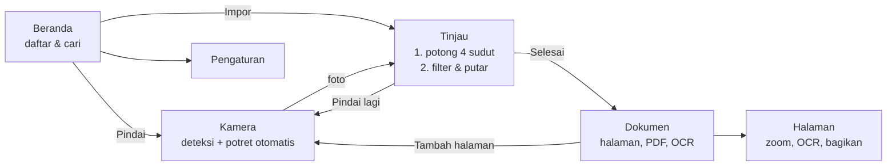

# ScanKu — Pemindai Dokumen Android

Last updated: 2026-10-05 09:00 AM WIB

Aplikasi pemindai dokumen ala CamScanner: deteksi tepi otomatis, potret otomatis, koreksi perspektif, filter, OCR, dan ekspor PDF — **sepenuhnya offline**. Kotlin + Jetpack Compose + CameraX + OpenCV + ML Kit.

## Contents
- [Fitur](#fitur)
- [Cara build](#cara-build)
- [Alur aplikasi](#alur-aplikasi)
- [Arsitektur](#arsitektur)
- [Cara kerja deteksi otomatis](#cara-kerja-deteksi-otomatis)
- [Keamanan & privasi](#keamanan--privasi)
- [Pengujian](#pengujian)
- [Troubleshooting](#troubleshooting)
- [Batasan](#batasan)

## Fitur

| Fitur | Keterangan |
|---|---|
| Deteksi tepi real-time | Garis dokumen digambar di atas preview kamera (kuning = mencari, hijau = terkunci) |
| Potret otomatis | Memotret sendiri saat dokumen stabil ±1,1 detik; cincin progres di tombol rana; bisa dimatikan |
| Mode batch | "Pindai lagi" menambah halaman ke dokumen yang sama |
| Impor galeri | Photo Picker sistem — tanpa izin penyimpanan |
| Potong manual | 4 sudut bisa diseret, dengan **lensa pembesar 2,5×**; tombol Otomatis / Penuh |
| Koreksi perspektif | Dokumen miring diratakan menjadi persegi panjang |
| Filter | Ajaib (hapus bayangan, kertas jadi putih), Asli, Abu-abu, Hitam putih, Cerahkan; putar 90° |
| OCR offline | ML Kit (model bundled, aksara Latin — Indonesia & Inggris); hasil disimpan dan **ikut dicari** |
| Dokumen | Cari, ganti nama, hapus, ubah urutan / hapus halaman, zoom halaman |
| Ekspor | Bagikan PDF / JPG, simpan PDF ke lokasi pilihan; ukuran A4, Letter, atau sesuai gambar |
| Tampilan | Material 3, mode Terang / Gelap / Ikuti sistem |

<sub>[↑ Back to contents](#contents)</sub>

## Cara build

**Prasyarat:** Android Studio (Ladybug 2024.2 atau lebih baru), JDK 17, Android SDK 35. Perangkat/emulator Android 7.0 (API 24)+.

1. Ekstrak ZIP, lalu **File → Open** folder `ScanKu` di Android Studio.
2. Tunggu Gradle sync (mengunduh AGP 8.7.3, Kotlin 2.1.0, OpenCV 4.10.0, dll.).
3. Jalankan konfigurasi **app** ke perangkat. Kamera emulator bisa dipakai, tapi deteksi paling baik dicoba di HP asli.

Dari terminal:

```bash
./gradlew testDebugUnitTest   # unit test
./gradlew assembleDebug       # APK debug → app/build/outputs/apk/debug/
```

**Rilis bertanda tangan** — kredensial hanya dari environment, tidak pernah di-commit:

```bash
export SCANKU_KEYSTORE=/path/ke/release.jks
export SCANKU_KEYSTORE_PASSWORD=...   # ambil dari password manager Anda
export SCANKU_KEY_ALIAS=scanku
export SCANKU_KEY_PASSWORD=...
./gradlew bundleRelease               # .aab untuk Play Store (split per ABI otomatis)
```

<sub>[↑ Back to contents](#contents)</sub>

## Alur aplikasi



<sub>[↑ Back to contents](#contents)</sub>

## Arsitektur

```
app/src/main/java/com/scanku/app/
├── core/            # Kotlin murni, tanpa Android — diuji di JVM
│   ├── geometry/    #   Quad (urutan sudut, konveksitas, ukuran warp), fitCenter
│   ├── scan/        #   StabilityTracker (kapan potret otomatis)
│   └── util/        #   FileNames (sanitasi), ImageMath, PdfLayout
├── imaging/         # OpenCV: DocumentDetector, ImageProcessor (warp + filter), BitmapIo
├── camera/          # DocumentAnalyzer (CameraX → deteksi per frame)
├── data/            # Room (dokumen, halaman), DocumentRepository, CaptureStore
├── export/          # ExportService (PDF/JPG), ShareHelper (FileProvider)
├── ocr/             # OcrEngine (ML Kit)
├── settings/        # SettingsRepository (SharedPreferences → StateFlow)
└── ui/              # Compose: home, camera, review, document, page, settings, theme
```

- **Penyimpanan:** metadata di Room (`documents`, `pages`), gambar halaman JPEG di `filesDir/docs/<id>/<uuid>.jpg`. Foto mentah sementara di `cacheDir/captures`, ekspor sementara di `cacheDir/exports` — keduanya dibersihkan saat aplikasi dibuka.
- **Memori:** gambar kerja dibatasi sisi panjang 3200 px; pratinjau filter memakai salinan 1400 px agar ganti filter instan, filter final diterapkan ulang pada resolusi penuh saat simpan.
- **Tanpa framework DI:** `AppContainer` sederhana di `ScanApp`.

<sub>[↑ Back to contents](#contents)</sub>

## Cara kerja deteksi otomatis

1. CameraX `ImageAnalysis` mengirim frame 640×480; hanya bidang luminansi (Y) yang dipakai — tanpa konversi warna per frame.
2. `DocumentDetector`: Gaussian blur → Canny dengan ambang dari Otsu (menyesuaikan pencahayaan) → dilate. Jalur cadangan: biner Otsu + morphological close (kertas terang di meja gelap).
3. Kontur terbesar disederhanakan (`approxPolyDP`, 3 tingkat epsilon; kontur bergerigi dicoba lewat convex hull). Segi empat **konveks** terbesar yang menutupi ≥12% frame dipilih.
4. Sudut diurutkan searah jarum jam dengan sort sudut terhadap titik pusat — tetap benar walau kertas diputar 45°.
5. `StabilityTracker` membandingkan tiap frame dengan *anchor* (bukan frame sebelumnya) sehingga gerakan lambat pun mereset timer. Stabil 1,1 detik → potret. Jeda 1,5 detik setelah kembali ke kamera mencegah memotret halaman yang sama dua kali.
6. Pada foto resolusi penuh, deteksi dijalankan lagi untuk posisi sudut awal di layar potong.

<sub>[↑ Back to contents](#contents)</sub>

## Keamanan & privasi

- **Offline:** izin `INTERNET` dihapus dari manifest gabungan (`tools:node="remove"`); OCR memakai model bundled.
- **Tidak ada backup otomatis:** `allowBackup=false` + `data_extraction_rules.xml` mengecualikan semua data dari backup cloud dan transfer perangkat (dokumen seperti KTP/kontrak bersifat sensitif). **Cadangan = ekspor PDF** ke lokasi pilihan Anda.
- **FileProvider sempit:** hanya `cache/exports/` yang bisa dibagikan, dengan izin baca sementara.
- **Validasi input:** impor dibatasi 40 MB dan harus ter-decode sebagai gambar; decoding memakai `inSampleSize` untuk menahan gambar raksasa (decompression bomb). Nama file antar-layar hanya menerima nama UUID buatan aplikasi; path halaman dicek kanonik agar tidak keluar direktori. Nama dokumen disanitasi sebelum jadi nama file ekspor. Pencarian memakai query Room berparameter dengan escape `LIKE`.
- **Rahasia:** tidak ada kunci API; keystore rilis hanya lewat environment variable.

<sub>[↑ Back to contents](#contents)</sub>

## Pengujian

Unit test (JVM, tanpa emulator) di `app/src/test`: 38 kasus untuk `Quad`, `fitCenter`, `StabilityTracker`, `FileNames`, `ImageMath`, `PdfLayout`.

Uji manual yang disarankan di HP asli:
- Dokumen di meja gelap, terang, dan bermotif; kertas miring; struk panjang; lampu redup + lampu kilat.
- Batch 5+ halaman → ekspor PDF → buka di pembaca PDF.
- OCR halaman bahasa Indonesia → cari kata dari isi teks di beranda.
- TalkBack: semua tombol ikon punya label; ukuran sentuh ≥ 48 dp.

<sub>[↑ Back to contents](#contents)</sub>

## Troubleshooting

| Gejala | Penyebab / solusi |
|---|---|
| Gradle sync gagal mengunduh | Butuh akses ke `google()` dan `mavenCentral()`; periksa proxy/VPN. |
| `UnsatisfiedLinkError` / deteksi tidak muncul | ABI perangkat tidak ada di `abiFilters` (`app/build.gradle.kts`). Tambahkan `x86` jika memakai emulator 32-bit. |
| Tepi tidak terdeteksi | Beri kontras antara kertas dan latar, cahaya merata. Tetap bisa potret manual lalu atur sudut. |
| Potret otomatis terlalu cepat/lambat | Ubah `AUTO_CAPTURE_HOLD_MS` dan `tolerance` di `CameraViewModel`. |
| Tombol izin kamera tidak memunculkan dialog | Izin ditolak permanen — aktifkan di Pengaturan sistem → Aplikasi → ScanKu → Izin. |
| Setelah aplikasi dimatikan sistem di layar Tinjau muncul "Gambar tidak dapat dibuka" | Foto mentah sementara dibersihkan saat start; pindai ulang. |
| APK besar | OpenCV membawa library native per ABI. Pakai `bundleRelease` (.aab) agar Play mengirim satu ABI saja. |

<sub>[↑ Back to contents](#contents)</sub>

## Batasan

- **Belum dikompilasi di lingkungan pembuatannya** (tidak ada akses ke repositori Google Maven di sana). Logika inti sudah diuji; kode Android ditinjau manual. Kemungkinan perlu perbaikan kecil saat pertama kali build — lihat pesan error Gradle.
- Versi dependensi dipatok ke rilis stabil akhir 2024; Dependabot (`.github/dependabot.yml`) akan mengusulkan pembaruan.
- `gradle-wrapper.properties` belum memuat `distributionSha256Sum`; tambahkan dari halaman checksum resmi Gradle untuk verifikasi integritas.
- OCR hanya aksara Latin. Belum ada: tanda tangan, watermark, PDF berpassword, sinkronisasi cloud.

<sub>[↑ Back to contents](#contents)</sub>
